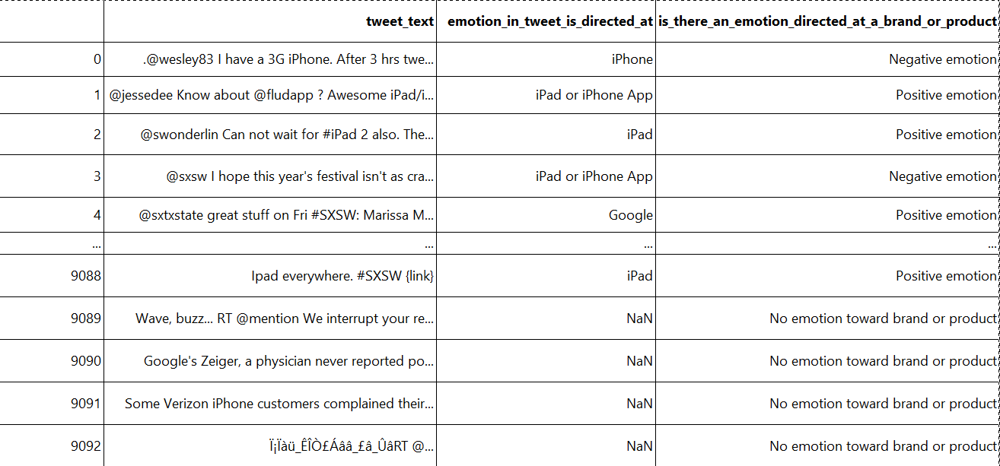
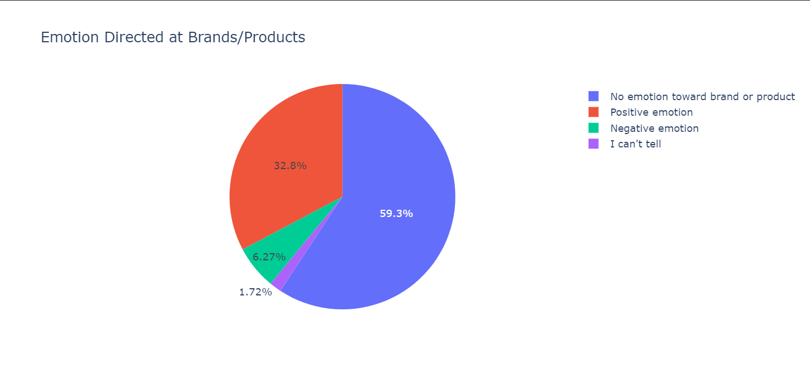

# Sentiment_project

## 1. Project Overview

This project aims to develop a Natural Language Processing (NLP) model to analyze sentiment in Tweets related to Apple and Google products. By classifying the sentiment of these Tweets as positive, negative, or neutral, the model will provide valuable insights into public perception, aiding businesses in marketing strategies and product development.

**Business Problem:**

In an era dominated by social media, brands must continuously track customer sentiments expressed online. Twitter, in particular, has become a critical platform where users voice their opinions about products and brands. However, the vast volume and rapid pace of tweets make it impractical for businesses to manually analyze these opinions for insights. To address this, a Natural Language Processing (NLP) model needs to be developed to automatically classify the sentiment of tweets and determine which brand or product is the target of those sentiments.

The dataset from CrowdFlower includes over 9,000 tweets that have been evaluated for sentiment (positive, negative, or no emotion) and tagged with the associated brand or product. The goal is to build an NLP model that can accurately and efficiently:

1. **Classify Sentiments**: Identify whether a tweet expresses positive, negative, or no emotion.
2. **Identify Brand/Product**: Recognize which brand or product is being referred to in the tweet.
3. **Handle Ambiguity**: Deal with tweets that might reference multiple brands or unclear sentiments.

Key challenges include:

- **Textual Variations**: Dealing with informal language, abbreviations, emojis, and slang used on social media.
- **Context Understanding**: Ensuring the model understands subtle and implicit expressions of sentiment.
- **Real-Time Processing**: Building a scalable solution that can process large volumes of data in real time for timely insights.

Solving this problem will help brands enhance their reputation management, respond promptly to consumer feedback, and optimize their marketing strategies based on real-time sentiment analysis.

9093 rows × 3 columns

In this project,we took sentiment as our target variable and tweets as our independent variable. Initially we did a binary classification of positive and negative sentiments.

We also did a multiple classification  investigating effects of neutral sentiments. The following is a table for multiple classification:

We then  removed class imbalances and the following is the summary of our results:

# Sentiment Analysis Model Comparison

## Results Summary

### Binary Classification (Positive vs Negative)

| Model               | Accuracy (CW) | F1 Score (CW) | Accuracy (SMOTE) | F1 Score (SMOTE) |
|---------------------|---------------|---------------|------------------|------------------|
| Logistic Regression | 0.8333        | 0.8453        | 0.8630           | 0.8688           |
| Random Forest       | 0.8842        | 0.8599        | 0.8884           | 0.8695           |
| SVM                 | 0.9054        | 0.8973        | 0.8955           | 0.8755           |
| Gradient Boosting   | 0.8672        | 0.8280        | 0.8404           | 0.8401           |
| Neural Network      | 0.8912        | 0.8873        | 0.8927           | 0.8890           |
| XGBoost             | 0.8701        | 0.8486        | 0.8658           | 0.8492           |

### Multi-class Classification (Positive vs Negative vs Neutral)

| Model               | Accuracy (CW) | F1 Score (CW) | Accuracy (SMOTE) | F1 Score (SMOTE) |
|---------------------|---------------|---------------|------------------|------------------|
| Logistic Regression | 0.8854        | 0.8848        | 0.8848           | 0.8845           |
| Random Forest       | 0.8904        | 0.8763        | 0.8909           | 0.8798           |
| SVM                 | 0.8970        | 0.8903        | 0.8981           | 0.8903           |
| Gradient Boosting   | 0.8893        | 0.8707        | 0.8815           | 0.8799           |
| Neural Network      | 0.8501        | 0.8472        | 0.8281           | 0.8296           |
| XGBoost             | 0.8909        | 0.8779        | 0.8909           | 0.8847           |

#### Results Summary Analysis:

1. Handling class imbalances significantly improved model performance, especially for the minority class (negative emotions).

2. In binary classification, SVM with class weighting performed best (Accuracy: 0.9054, F1 Score: 0.8973).

3. For multi-class classification, SVM with class weighting again showed the best results (Accuracy: 0.8970, F1 Score: 0.8903).

4. SMOTE and class weighting techniques showed similar improvements, with class weighting slightly outperforming SMOTE in most cases.

5. Neural Networks performed well in binary classification but lagged in multi-class scenarios.

6. Use SVM with class weighting as the primary model for both binary and multi-class sentiment analysis tasks.

Conclusion
After processing the data and applying machine learning models, including Logistic Regression, Random Forest, and XGBoost, we were able to:

    Evaluate Model Performance: We assessed the models using accuracy, confusion matrices, and classification reports. This allowed us to determine how well each model performed in classifying the different sentiments.
    Hyperparameter Tuning: We optimized model parameters to improve predictive performance. The tuned models offered better accuracy and insights into sentiment classification.
    Key Findings

Recommendations

    Focus on Neutral Sentiment:
        Engagement Strategies: Develop strategies to engage users who express neutrality. Target these consumers with tailored content that can potentially shift their sentiment to positive.

        Enhance Positive Sentiment:
        Amplify Positive Feedback: Promote positive sentiments in marketing campaigns and leverage testimonials from satisfied customers to enhance brand image.